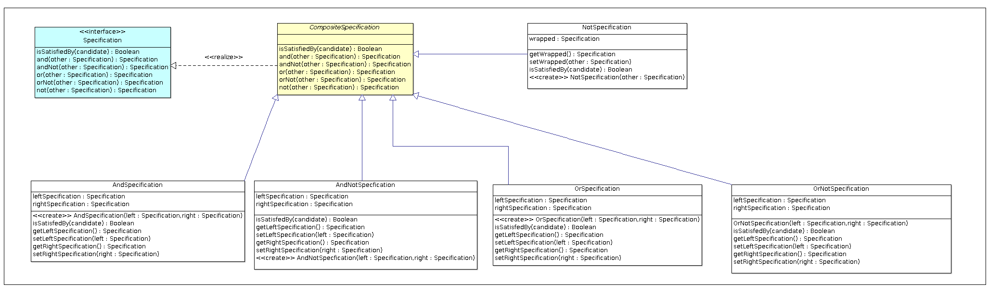

# Specification Pattern

This is a simple implementation of `Specification Pattern`, that is powerful for managing business rules for example without using a `Rule Engine`.
This implementation is written in `Java`.

## UML Diagram

